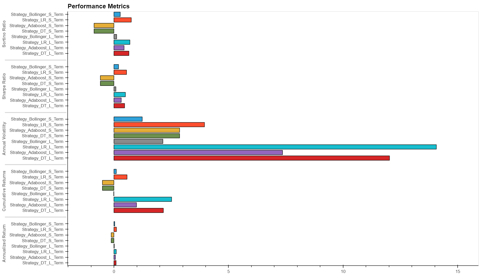

# Grow me the MONEY!!

## Problem Statement
The stock investing market is quite vast and there are multitudes of different approaches that people use for their stock investing which could be based on Research, Rumours, Advice from family / friends, Professional Advice or in a modern day, Advice from Robots or Machines.

With the advice from the machines, there again are multiples of different models which are in play to predict the price movement on the stock but which one is suitable or performs better across the market? We don't know and we are seeking to find out!

## Objective
To analyse the S&P 500 trading data for the past 20 years using various machine learning models and provide a visual comparison and evaluation on how each model performs.

The most efficient model can then be used by the Amazon Lex based RoboAdvisor to advise users on how much returns they can expect on their initial investment.  

*RoboAdvisor is not part of this project due to the time constraints*.

The project was analysed in July 2022 by :
-   Padma Ram
-   Roy Booker
-   Jigar Lotia

The project uses various Notebooks to perform the analysis with high level process flow depicted as below:

## High Level Process Flow

Each of the notebook and the corresponding process that happens is described as below:

## Notebook 1 - Data Preparation

This [notebook](src/Data_Processing.ipynb) uses the historical price of S&P 500 Index for past 20 years.  This data is sourced from [Investing.com](https://au.investing.com/indices/us-spx-500) and is stored as [S&P500_Data.csv](data/SP500_Data.csv).

The notebook performs the following pre-processing using the `Pandas DataFrame` :
- Parse Dates in the data file with `parse_dates` attribute
- Calculate daily percentage change using the `pct_change` function
- Dropping nulls using `dropna` function

In addition, this notebook also performs the following step to prepare the data that can be used by various machine learning models: 

- Calculate the Simple Moving Average (SMA) for perod of 4 days and 50 days which are used as short window and long window. This is a features dataset.
- Buy / Sell signal calculation based on whether the short window of SMA crosses the long window which is interpreted as **Buy** signal otherwise as the **Sell** signal.  This is a target dataset.
- Both feature and target datasets are then split into training and testing data with 30:70 ratio.  Also further to that, the data is also split into long term data and short term data for training and testing suitable for long term (15 years) and short term (5 years) investing strategy.
- The training and testing datasets are then exported as `CSV` file and stored in the [data folder](data/) and is then saved into the [data folder](data/) to be consumed by the subsequent machine learning models.

## Notebook 2 - Logistic Regression Model
This [notebook](src/Strategy_LR.ipynb) aims to uses the short term and long term created in the previous step from then [data folder](data/) folder and then analyse the suitability of the [Logistic Regression Model](https://scikit-learn.org/stable/modules/linear_model.html#logistic-regression) (which is a type of `Linear Model`) to see if the model is suitable to predict the trading signals for the data.  Various performance indicators and metrics as described below are captured and recorded.  

The following process is applied to analyse the model and capture the metrics.

- The test and training data for both short term and long terms are scaled using `StandardScaler`.
- The scaled data is then trained with the training data and fit into the Logistic Regression Model.
- The model is then used for prediction of signals using the testing data with both long term and short term investing strategy.
- The model is then compared with the actual results and the `Classification Report` is visualised to see the accuracy of the model.
- Performance metrics such as `Annualized Return`, `Cumulative Returns`, `Annual Volatility`, `Sharpe Ratio	`, `Sortino Ratio`, `Max Actual Return`, `Max Strategy Return`, `SS Lag` and `Max SReturn Lag`	are calculated on the predicted data for both long term and short term investing strategy.
- The performance metrics are then saved as the `CSV` file and stored in the [data folder](data/) which is used by the visualation notebook covered later.

## Notebook 3 - Decision Tree Classifier Model
Similar to the above notebook, this [notebook](src/decision_tree_2.ipynb) aims to uses the short term and long term created in the previous step from then [data folder](data/) folder and then analyse the suitability of the [Decision Tree Classifier Model](https://scikit-learn.org/stable/modules/tree.html#classification) (which is a type of `Decision Tree Model`) to see if the model is suitable to predict the trading signals for the data.  Various performance indicators and metrics as described below are captured and recorded.  

The following process is applied to analyse the model and capture the metrics.

- The test and training data for both short term and long terms are scaled using `StandardScaler`.
- The scaled data is then trained with the training data and fit into the Decision Tree Classifier Model.
- The model is then used for prediction of signals using the testing data with both long term and short term investing strategy.
- The model is then compared with the actual results and the `Classification Report` is visualised to see the accuracy of the model.
- Performance metrics such as `Annualized Return`, `Cumulative Returns`, `Annual Volatility`, `Sharpe Ratio`, `Sortino Ratio`, `Max Actual Return`, `Max Strategy Return`, `SS Lag` and `Max SReturn Lag`	are calculated on the predicted data for both long term and short term investing strategy.
- The performance metrics are then saved as the `CSV` file and stored in the [data folder](data/) which is used by the visualation notebook covered later.

## Notebook 4 - AdaBoost Classifier Model
Similar to the above notebook, this [notebook](src/adaboost_strategy.ipynb) aims to uses the short term and long term created in the previous step from then [data folder](data/) folder and then analyse the suitability of the [Decision Tree Classifier Model](https://scikit-learn.org/stable/modules/tree.html#classification) (which is a type of `Ensemble Supervised Learning`) to see if the model is suitable to predict the trading signals for the data.  Various performance indicators and metrics as described below are captured and recorded.  

The following process is applied to analyse the model and capture the metrics.

- The test and training data for both short term and long terms are scaled using `StandardScaler`.
- The scaled data is then trained with the training data and fit into the Decision Tree Classifier Model.
- The model is then used for prediction of signals using the testing data with both long term and short term investing strategy.
- The model is then compared with the actual results and the `Classification Report` is visualised to see the accuracy of the model.
- Performance metrics such as `Annualized Return`, `Cumulative Returns`, `Annual Volatility`, `Sharpe Ratio`, `Sortino Ratio`, `Max Actual Return`, `Max Strategy Return`, `SS Lag` and `Max SReturn Lag`	are calculated on the predicted data for both long term and short term investing strategy.
- The performance metrics are then saved as the `CSV` file and stored in the [data folder](data/) which is used by the visualation notebook covered later.

## Notebook 5 - Bollinger Band Strategy Analysis
This [notebook](src/Strategy_Bollinger_trading_signals.ipynb) uses the historical price of S&P 500 Index for past 20 years.  This data is sourced from [Investing.com](https://au.investing.com/indices/us-spx-500) and is stored as [S&P500_Data.csv](data/SP500_Data.csv).

Similar to [Notebook 1](src/Data_Processing.ipynb), it also applies similar the pre-processing techniques to clean the data and calculates  daily percentage change using the `pct_change` function.  

In addition, this notebook also performs the following steps to create some performance metrics which is then used for comparision with the various machine learning models covered above: 

- Calculate the Upper, Middle and Lower Bollinger Bands using the `FinTA` python library.
- The bands are then used to generate the **Buy** signal when the closing price is lower than the lower Bollinger Band and **Sell** signal if the closing prices is higher than the upper Bolllinger Band.
- Using the above signals logic, a backtesting is carried out with `100k` initial capital and with `10` shares.
- The performance metrics are calcuated comparing the actual returns v/s returned generated by Bollinger Band strategy.
- Performance metrics such as `Annualized Return`, `Cumulative Returns`, `Annual Volatility`, `Sharpe Ratio` and `Sortino Ratio` are calculated on the predicted data for both long term and short term investing strategy.
- The performance metrics are then saved as the `CSV` file and stored in the [data folder](data/) which is used by the visualation notebook covered later.

## Notebook 6 - Data Visualisation

All the performance metrics of the notebook which are exported as CSV file from the previous notebooks and stored in the [data folder](data/), are used by this noteboook to provide the comparision of the results.

Key plots prepared as part of this notebook is as below:
### Comparison Cumulative Returns - Long Term.

### Comparison Cumulative Returns - Short Term.

### Lag difference of Max Actual and Strategy return - Long Term

### Lag difference of Max Actual and Strategy return - Short Term

### Overall Performance Metrics

## Findings and Summary
The analysis and comparison of the vairous models have produced some interesting findings which are summarised as below:
- Long term investing strategy models performed better than the short term investing strategy
- Higher SMA window provides better model performance than smaller SMA windows
- Logistic Regression Model performed best of all the models based on the comparison of all performance metrics.

## Next Steps
The most efficient model can then be used by the [Amazon Lex](https://aws.amazon.com/lex/) based **RoboAdvisor** to advise users on how much returns they can expect on their initial investment.
RoboAdvisor is not part of this project due to the time constraints.

Other machine learning models or processing technique may need to be trained and tested periodically to assess new technologies or models. The models we completed were considered all that we had time for during the project.

## Slide Deck Link

## Resources
- [Investing.com](https://au.investing.com/indices/us-spx-500) for S&P 500 Data.
- [Scikit Learn](https://scikit-learn.org/stable/supervised_learning.html) for various machine learning models.
